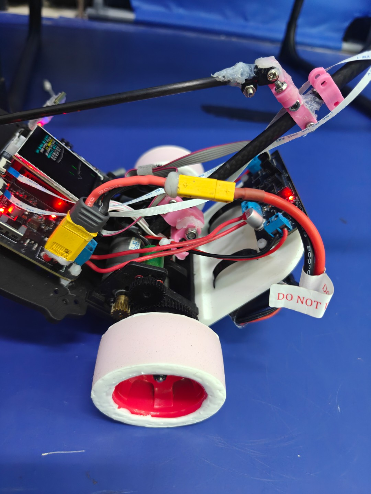
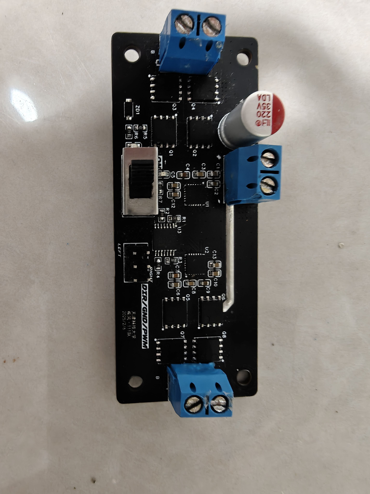
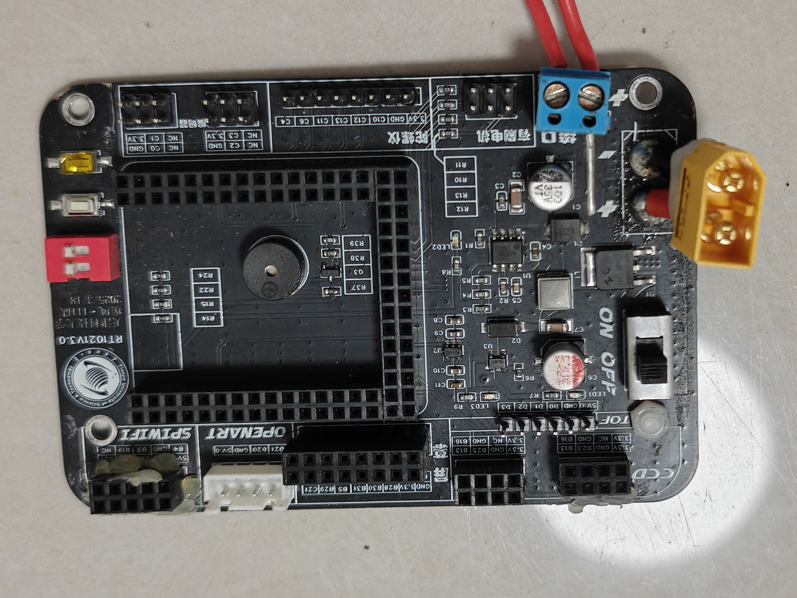
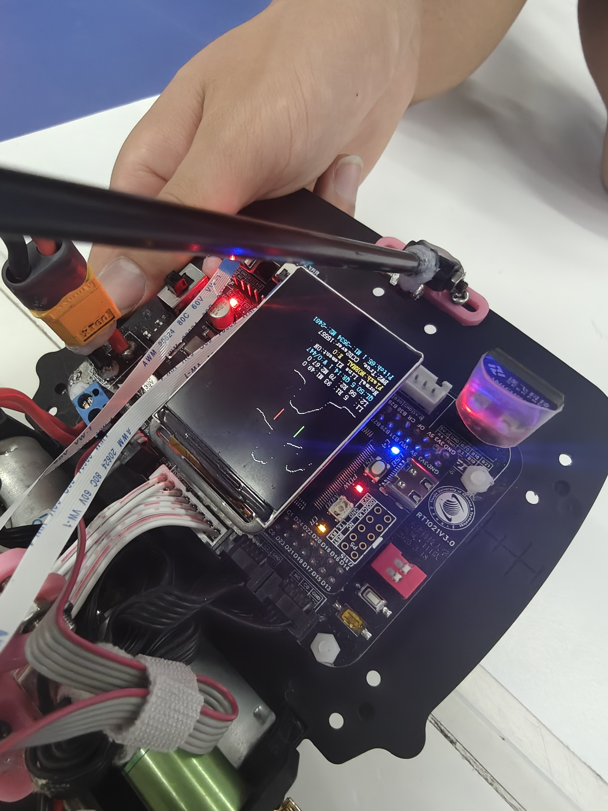
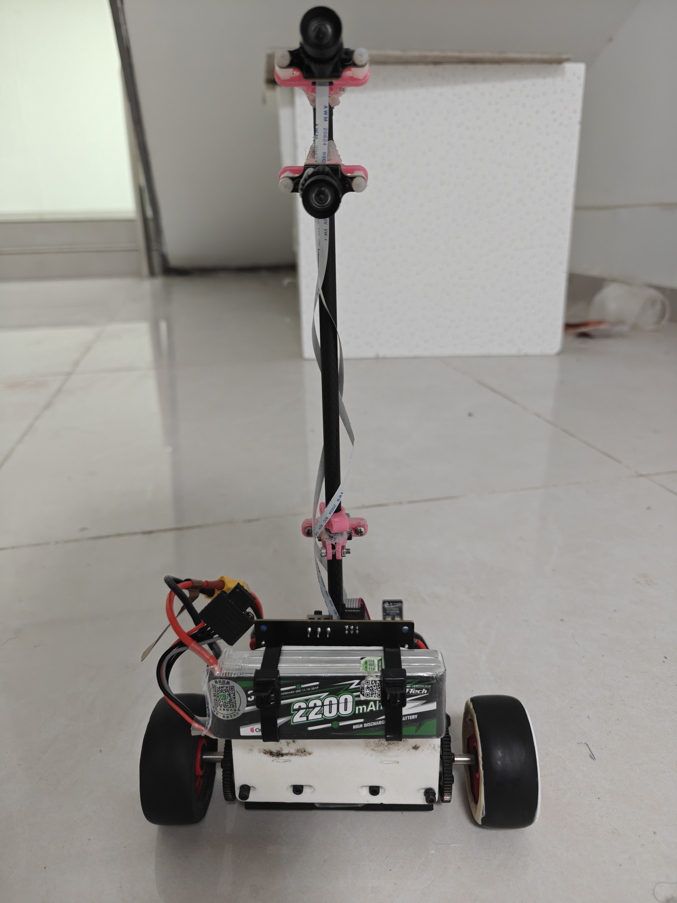

# SmartCar - NXP 

> 第二十届全国大学生智能汽车竞赛 华北赛区 microPython赛道组 省二代码开源）

当前仓库的 `user_main.py` 并不是省赛当天以及前几天反复试车时用的那套代码，比赛前临时在现场改了不少细节，结果忙完之后忘记push代码了(然后现在代码也找不到了)，只有目前这个，当个纪念吧。

## 任务概述
主要是两轮车，需要完成平衡站立，并且跑起来，赛道元素除了正常赛道、环岛、弯外，还有坡、需要避障的障碍物等

## 概览
- 双 CCD（近端 32 宽、远端 30 宽）巡线，阈值和梯度检测算法参考的开源的代码，重点是近端更灵敏便于判断赛道边界。
- 赛道特殊元素用状态机描述：环岛（七阶段）、十字、停车区都靠编码器积分+阈值切换来定位。
- WiFi SPI 模块用来远程调参，吐槽一下逐飞的这玩意确实很难用，连接上都要半天，功能还少，用起来也不方便。
- 摄像头串口只负责告诉主控“左/右/无”障碍，结合编码器距离决定什么时候重新启用避障。
- `openART.py` 负责最初的算例搬运，核心控制都在 `user_main.py`，想看算法直接打开那一个文件就够了。

## 算法 & 控制
### CCD 巡线与感知
CCD 数据先做一次滤波，再用梯度阈值找左右边界。近端 CCD 偏向于快速响应，远端 CCD 提供“趋势”参考；当二值化检测到黑场时会触发停车/起跑线逻辑。环岛内会暂时把梯度倍数降到 18，避免把环岛内侧误当作缺口。

### 环岛 / 十字 / 元素识别
环岛用编码器积分区分“准备进环 → 入环 → 出环 → 回归巡线”几个阶段，同时根据 `ring_left` / `ring_right` 标志做不同偏角。十字路口则记下出现时的 `MIDDLE_LINE`，并设置一个延迟距离防止刚出环时误触发。`element_en` 默认关着，开的话会尝试看相机识别赛道元素。

### PID 控制
`PIDController` 类被实例化成三条：`pid_angle_speed` 负责角速度限制，`pid_angle` 控制横摆/转向，`pid_speed` 管纵向速度。巡线偏差会先合成 `line_control_output`，再叠加 PID 输出给舵机；速度 PID 会把编码器反馈和车身姿态结合，遇到环岛/十字则动态下调目标速度，防止冲出赛道。

### 避障与通信
避障逻辑比较粗暴：当相机报“左/右”时把中线偏移 `AVOIDANCE_OFFSET` 像素，并设置一个重置距离，超过 `OBSTACLE_RESET_DISTANCE` 才允许下一次检测。串口协议简单到只有几个字符串，关键是保证 `camera_command_pending` 及时清零，否则串口堵塞整车就直接飘了。

### 其它
其它的就不是很清楚了，以上的只知道个大概，毕竟几个月之前的代码了，现在才拿过来稍微梳理了一下）写的比较乱，全写在一个文件里面是方便烧代码，我也想分文件写，但是那样烧录慢，并且存在好多莫名其妙的Bug，也不晓得官方在他那个固件里面加了什么猛料，分文件写其它地方还要处理一下才能导包进来，离谱。。

### 小车做的一托，各位佬如果有看见此仓库的（当然也不一定会有），勿喷

## 小车照片

